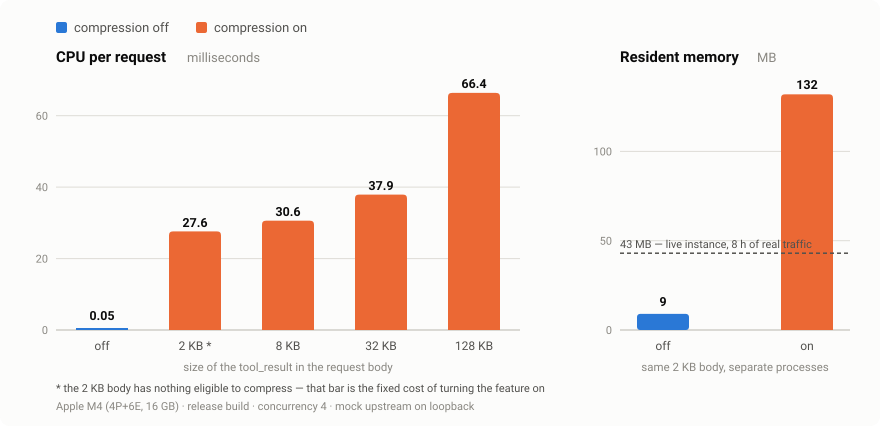

# mur-model-gateway

[English](README.md)

給 [MUR](https://github.com/mur-run/mur) agent 平台用的本機 LLM API gateway。
讓你的 MUR agent（以及任何其他本機工具）透過單一本機端點呼叫 **Anthropic、OpenAI
與 Gemini** — 同時提供壓縮功能。

```
agents / tools ──► http://127.0.0.1:8088 ──► api.anthropic.com
                                         ──► api.openai.com
                                         ──► generativelanguage.googleapis.com
```

## 為什麼要用

- **把訂閱分租出去。** 沒帶認證進來的請求，會自動補上正確的憑證 —
  `/v1/messages` 用 Claude Code 存在 OS keychain 裡的 OAuth token，
  `/v1/responses` 用 Codex CLI 存在 `~/.codex/auth.json` 裡的 token —
  讓 agent 共用你已經付費的方案。
- **單一出口。** 所有工具都指向 `127.0.0.1:8088`，gateway 依路徑分流 —
  `/v1/messages*` → Anthropic、`/v1/chat/completions*` / `/v1/embeddings*`
  → OpenAI、`/v1beta/models/*` → Gemini、`/v1/responses*` → Codex。
- **可選的 wire 壓縮。** `MUR_MODEL_GATEWAY_COMPRESS=1` 會對三家供應商的
  `tool_result` 區塊套用 MUR 的 CCR 壓縮。
- **開著不心疼。** 單一靜態 Rust binary，關閉壓縮時常駐約 40 MB —
  沒有 runtime、沒有 Node process、沒有容器。[實測數字見下](#資源用量與規模)。

**最高 90.4% token 節省** — 3,026 次壓縮把 5.89M input token 變成 568K，
省下 5.32M（mur-compress v2.61.0，單日）：


## 安裝

到 [Releases](https://github.com/mur-run/mur-model-gateway/releases) 抓 binary
（macOS universal，已用 Developer ID 簽章並公證；Linux x86_64；Windows x86_64），
或自己從原始碼 build（Rust ≥ 1.85）：

```bash
cargo build --release
```

以背景服務執行（launchd / systemd / Task Scheduler 的描述檔會自動產生）。
**不主動要求的話壓縮是關的** — 加上 `--compress`，它會被烘進服務定義，
重開機與重裝都不會流失：

```bash
mur-model-gateway install --compress   # 寫入並啟動服務，壓縮開啟
mur-model-gateway status               # 列出 binary / 服務 / env 檔狀態
mur-model-gateway uninstall
```

從原始碼安裝的話，`./scripts/setup.sh -- --compress` 會一次做完 build、安裝與
服務註冊。

要還原被壓縮的 `tool_result`，client 端必須掛上 mur MCP server — `mur_retrieve`
是它提供的。各平台細節見 [docs/install-tw.md](docs/install-tw.md)，
壓縮設定見 [docs/compress-setup-tw.md](docs/compress-setup-tw.md)。

## 搭配 MUR 使用

把 model registry 的項目指向 gateway：

```yaml
# ~/.mur/models.yaml
models:
  - alias: sonnet
    provider: anthropic
    model: claude-sonnet-5
    base_url: http://127.0.0.1:8088
```

用這個 alias 的 agent 就會走你的 Claude Code 登入。因為釋出的 binary 用固定的
Developer ID 簽章，macOS 只會問**一次** keychain 存取 —「總是允許」在每次更新後
都還有效。

**MUR agent 現在還不能用 Codex 路由。** `/v1/responses` 講的是 OpenAI 的
Responses API，但 MUR 自己的 OpenAI client 只會講 Chat Completions
（`POST $base_url/chat/completions`）— 它沒有 Responses API 的 client。
在轉譯層（未來的 stage）做出來之前，`/v1/responses` 只有本來就講 Responses
API 的 client（例如 `curl`、Codex CLI 本身）能用 — 不是把 MUR model registry
指過去就能用。

## 設定

| 環境變數 | 預設 | 意義 |
|---|---|---|
| `MUR_MODEL_GATEWAY_BIND` | `127.0.0.1:8088` | 監聽位址 |
| `MUR_MODEL_GATEWAY_TOKEN_SOURCE` | `keychain` | `keychain`、`off`、`env:<VAR>`、`file` 或 `file:<path>` |
| `MUR_MODEL_GATEWAY_TOKEN_SOURCE_CODEX` | `codex` | `/v1/responses` 的憑證來源 — `codex`、`off`、`env:<VAR>` |
| `MUR_MODEL_GATEWAY_UPSTREAM_ANTHROPIC` | `https://api.anthropic.com` | Anthropic 上游 |
| `MUR_MODEL_GATEWAY_UPSTREAM_OPENAI` | `https://api.openai.com` | OpenAI 上游 |
| `MUR_MODEL_GATEWAY_UPSTREAM_GEMINI` | `https://generativelanguage.googleapis.com` | Gemini 上游 |
| `MUR_MODEL_GATEWAY_UPSTREAM_CODEX` | `https://chatgpt.com/backend-api/codex` | Codex 上游 |
| `MUR_MODEL_GATEWAY_COMPRESS` | 關 | `1` 啟用 tool_result 壓縮 |

## 資源用量與規模



（圖表標示為英文：左圖是「每請求 CPU（毫秒）」，右圖是「常駐記憶體（MB）」；
藍色代表壓縮關閉，橘色代表開啟。）

- **關掉壓縮，這個 gateway 幾乎不花錢。** 每秒 5,000–22,000 個請求；實際運行的
  instance 在 8 小時內只用掉 2 分 22 秒 CPU — 單核的 0.5%。Raspberry Pi 就跑得動。
- **開啟後，壓縮引擎是每個請求都重建一次。** 這就是圖上那個固定的約 27 ms，
  即使請求裡沒有任何夠大的內容可壓也照樣要付，另外每 KB `tool_result` 再加約
  0.3 ms。抓 **每核心約 35 個壓縮請求／秒**。
- **對單一使用者來說這是雜訊：** 一次 5–30 秒的模型往返多 29 ms，換來約 90% 的
  token 節省。一個核心大約撐得住 100 個重度使用 agent 的開發者（每人約 20 請求／分）。
- **真正的天花板是 rate limit。** 每個請求都騎在同一組 Claude Code 登入上，
  所以先撞到的是那個帳號的上游流量限制，遠早於 CPU。要抓規模就抓 rate limit，
  不是抓機器。

`~/.mur/compress` 會保留每一份壓縮前的原文（以 hash 去重）供 `mur_retrieve` 還原；
尖峰 RSS 則隨 `並行數 × 請求大小` 成長 — 50 個並行的 150 KB 請求實測為 190 MB。

## 安全性

- 預設綁在 loopback；它是*本機*出口，不是共用伺服器。
- 已經帶認證的請求原樣轉發；只有沒帶認證的本機呼叫才會被補上憑證。
- Token 從 OS keychain 讀取（macOS Keychain / Linux keyutils / Windows
  Credential Manager）並快取 60 秒，不會寫進磁碟。

## 授權

[MIT](LICENSE)
