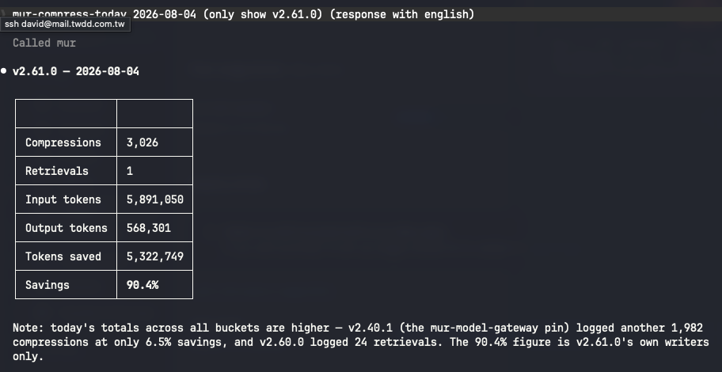

# mur-model-gateway

[中文說明](README-tw.md)

Local LLM API gateway for the [MUR](https://github.com/mur-run/mur) agent platform.
It lets your MUR agents (and any other local tool) call **Anthropic, OpenAI, and
Gemini** through one local endpoint — also provide compress feature.

```
agents / tools ──► http://127.0.0.1:8088 ──► api.anthropic.com
                                         ──► api.openai.com
                                         ──► generativelanguage.googleapis.com
```

## Why

- **Sublet your subscriptions.** Requests that arrive without auth get the
  right credentials attached — Claude Code's OAuth token from the OS
  keychain on `/v1/messages`, or the one Codex CLI stores at
  `~/.codex/auth.json` on `/v1/responses` — so agents share the plan you
  already pay for.
- **One outlet.** Point every tool at `127.0.0.1:8088`; the gateway routes by
  path — `/v1/messages*` → Anthropic, `/v1/chat/completions*` / `/v1/embeddings*`
  → OpenAI, `/v1beta/models/*` → Gemini, `/v1/responses*` → Codex,
  `/codex/v1/chat/completions` → ChatGPT Codex (translated — Chat Completions
  in, Responses upstream; point an OpenAI client here to use a ChatGPT
  subscription).
- **Optional wire compression.** `MUR_MODEL_GATEWAY_COMPRESS=1` applies MUR's
  CCR compression to `tool_result` blocks on all three providers.
- **Cheap to leave running.** One static Rust binary, ~40 MB resident with
  compression off — no runtime, no Node process, no container.
  [Measured numbers below.](#resource-usage-and-sizing)

**Up to 90.4% token savings** — 3,026 compressions turned 5.89M input tokens into
568K, saving 5.32M (mur-compress v2.61.0, single day):



## Install

Grab a binary from [Releases](https://github.com/mur-run/mur-model-gateway/releases)
(macOS universal, Developer-ID signed and notarized; Linux x86_64; Windows x86_64),
or build from source (Rust ≥ 1.85):

```bash
cargo build --release
```

Run it as a background service (launchd / systemd / Task Scheduler descriptors
are generated for you). **Compression is off unless you ask for it** — pass
`--compress` and it is baked into the service definition, so it survives
restarts and reinstalls:

```bash
mur-model-gateway install --compress   # writes + starts the service, compression on
mur-model-gateway status               # binary / service / env file overview
mur-model-gateway uninstall
```

From a source checkout, `./scripts/setup.sh -- --compress` does the build, the
install and the service registration in one shot.

Restoring a compressed `tool_result` needs the mur MCP server attached to your
client — that is what provides `mur_retrieve`. See
[docs/install.md](docs/install.md) for per-platform details and
[docs/compress-setup.md](docs/compress-setup.md) for compression.

## Use with MUR

Point a model registry entry at the gateway:

```yaml
# ~/.mur/models.yaml
models:
  - alias: sonnet
    provider: anthropic
    model: claude-sonnet-5
    base_url: http://127.0.0.1:8088
```

Agents using that alias now ride your Claude Code login. Because the released
binary is signed with a stable Developer ID, macOS asks for keychain access
**once** — "Always Allow" survives every update.

**MUR agents can use Codex through the translated route.** A translation layer
now lets MUR's Chat-Completions-only OpenAI client reach a ChatGPT subscription:
point a model registry entry at
`POST http://127.0.0.1:8088/codex/v1/chat/completions`, and the gateway
translates to the Responses API upstream. The raw `/v1/responses` endpoint
remains for clients that already speak the Responses API directly (`curl`, the
Codex CLI itself).

## Configuration

| Env var | Default | Meaning |
|---|---|---|
| `MUR_MODEL_GATEWAY_BIND` | `127.0.0.1:8088` | Listen address |
| `MUR_MODEL_GATEWAY_TOKEN_SOURCE` | `keychain` | `keychain`, `off`, `env:<VAR>`, `file`, or `file:<path>` |
| `MUR_MODEL_GATEWAY_TOKEN_SOURCE_CODEX` | `codex` | Credential source for `/v1/responses` — `codex`, `off`, `env:<VAR>` |
| `MUR_MODEL_GATEWAY_UPSTREAM_ANTHROPIC` | `https://api.anthropic.com` | Anthropic upstream |
| `MUR_MODEL_GATEWAY_UPSTREAM_OPENAI` | `https://api.openai.com` | OpenAI upstream |
| `MUR_MODEL_GATEWAY_UPSTREAM_GEMINI` | `https://generativelanguage.googleapis.com` | Gemini upstream |
| `MUR_MODEL_GATEWAY_UPSTREAM_CODEX` | `https://chatgpt.com/backend-api/codex` | Codex OAuth (ChatGPT) upstream |
| `MUR_MODEL_GATEWAY_COMPRESS` | off | `1` enables tool_result compression |

When `~/.codex/auth.json` is in `auth_mode = "apikey"`, the gateway sends
requests to `https://api.openai.com` instead; that host is deliberately not
configurable.

## Resource usage and sizing


- **Off, the gateway is free.** 5,000–22,000 req/s, and a live instance spent
  2m22s of CPU — 0.5% of one core — over 8 hours. A Raspberry Pi runs it.
- **On, the engine is built per request.** That is the flat ~27 ms above,
  charged even when nothing is eligible, plus ~0.3 ms per KB of `tool_result`.
  Budget about **35 compressed requests per second per core**.
- **Per person it is noise:** 29 ms on a 5–30 second model call, against a ~90%
  token saving. One core carries roughly 100 developers driving agents hard
  (~20 requests/minute each).
- **The rate limit binds first.** Every request rides a single Claude Code
  login, so that account's upstream limit caps you long before the CPU does.
  Size for the rate limit, not the box.

`~/.mur/compress` keeps every compressed original (deduplicated by hash) so
`mur_retrieve` can restore it, and peak RSS tracks `concurrency × body size` —
50 concurrent 150 KB requests measured at 190 MB.

## Security notes

- Binds to loopback by default; it is a *local* outlet, not a shared server.
- Requests that already carry auth are forwarded untouched; credential injection
  only happens for auth-less local callers.
- Tokens are read from the OS keychain (macOS Keychain / Linux keyutils /
  Windows Credential Manager) and cached for 60 s; they are never written to disk.

## License

[MIT](LICENSE)
